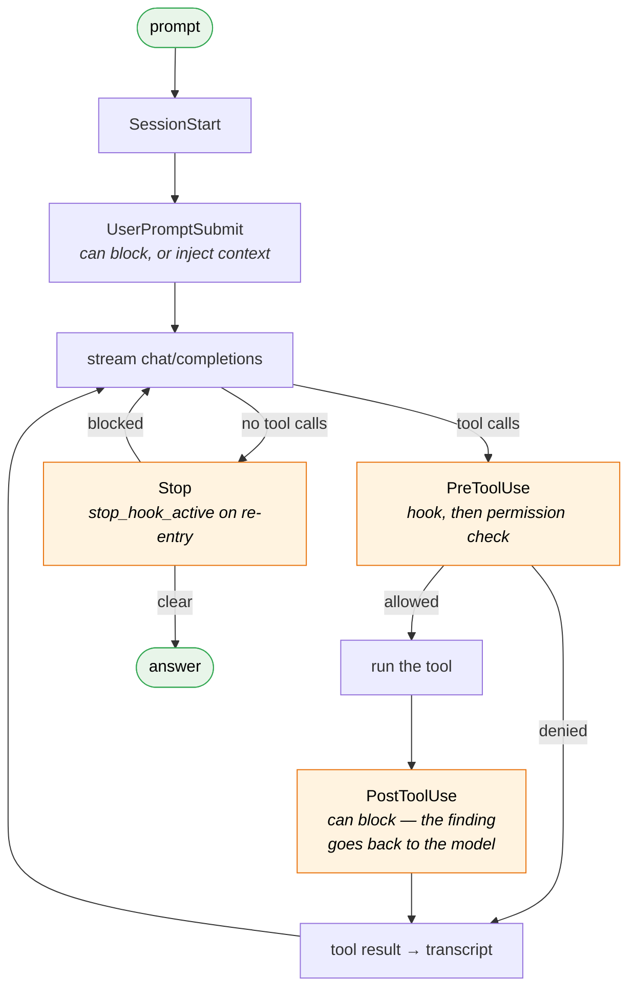

# serge-engine

An MIT agent runtime for [serge-brain](https://github.com/robsevo/serge-brain) —
the half that repo deliberately does not ship.

It speaks OpenAI-compatible HTTP to a local router, implements all 13 lifecycle
hook events, and writes the JSONL transcripts the brain's gates read back. It
never calls Anthropic.

---

## Table of contents

1. [Why this exists](#1-why-this-exists)
2. [How it fits](#2-how-it-fits) — the diagrams
3. [Install and pair](#3-install-and-pair)
   - [3.2 The session](#32-the-session)
4. [What works, and what does not](#4-what-works-and-what-does-not)
5. [The contract](#5-the-contract)
6. [Verification](#6-verification)
7. [Design notes](#7-design-notes)
8. [License](#8-license)

---

## 1. Why this exists

serge-brain is a configuration layer with no program in it. Its installer says so
in as many words:

```
install.sh:70   # The engine is deliberately not in this repo — it is a Claude
                # Code derivative.
install.sh:72   [ -n "$ENGINE" ] || die "--engine is required."
```

Every user had to supply `--engine /path/to/engine`, and the only thing that had
ever satisfied that slot was Anthropic's proprietary CLI — which serge-brain
cannot redistribute. The result was a public repo almost nobody could actually
run.

This is the missing half. It is not a Claude Code fork and shares no code with
one; it is a fresh implementation of the interface the brain expects.

> **Status: young, and honest about it.** Sessions, resume, MCP, skills, the
> brain's 16 named subagents and a read-only `Explore` all work. What is still
> missing is listed in [§4](#4-what-works-and-what-does-not) rather than glossed.

## 2. How it fits

### 2.1 Three parts, two seams

The brain holds the behaviour, this repo holds the loop, and the router holds
the models. Each seam is a contract, which is what lets any part be swapped.


The dotted edge is the one people miss. The transcript is not a log — the brain's
`claims-gate` walks it to check whether a turn's claims are true. Write it wrong
and a whole class of guardrail silently stops working.

### 2.2 One turn



Two edges carry most of the weight:

**`PostToolUse` can block.** The call already happened, so blocking cannot undo
it — what it does is force the model to deal with the finding instead of moving
on. The brain's `algo-gate`, `semgrep-scan` and `arch-gate` all work this way.
An engine that fires the hook and discards its verdict looks fully gated while
every one of those is dead.

**`Stop` can send the turn back**, and carries `stop_hook_active` when it does.
Without that flag a blocking gate has no way to stand down, and the session
loops forever.

## 3. Install and pair

Two clones, side by side. That is the whole integration.

```bash
git clone https://github.com/robsevo/serge-brain
git clone https://github.com/robsevo/serge-engine

( cd serge-engine && npm run build )
( cd serge-brain  && ./install.sh --engine ../serge-engine )
```

`npm run build` copies `src/` to `dist/` — instant, and no network. The brain's installer then
verifies the engine answers `--version`, resolves hook paths into
`~/.serge/settings.json`, and stops before writing a key or starting a service.

**Try it without touching an existing install:**

```bash
SERGE_HOME=~/.serge-trial ./install.sh --engine ../serge-engine
SERGE_HOME=~/.serge-trial serge -p "reply with: ok"
```

### Why two repos rather than one

| | serge-brain | serge-engine |
|---|---|---|
| what it is | configuration: hooks, gates, skills, router config | a runtime: agent loop, tools, permissions |
| changes when | how the agent should *behave* changes | what the agent *can do* changes |
| swappable | no — it is the product | yes — any conforming engine works |

A monorepo would couple them: every hook tweak would ship a new engine, and the
brain could no longer claim to run on *any* conforming engine — which is exactly
the property that lets you keep a Claude Code derivative underneath if you want
MCP or session resume, which this engine does not have yet.

They meet at a contract, not an API. If you pin, pin both to the same revision of
[`docs/ENGINE-CONTRACT.md`](docs/ENGINE-CONTRACT.md).

### 3.1 What the engine loads from the brain

| in the config dir | becomes |
|---|---|
| `settings.json` | 53 hook wirings across 13 events |
| `litellm.yaml` | the seat roster — `--seats`, and seat validation |
| `commands/*.md` | slash commands that expand to their authored prompt |
| `skills/<name>/SKILL.md` | an index at session start; bodies on demand via `Skill` |
| `.mcp.json` / `.claude.json` | MCP servers, tools namespaced per server |
| `CLAUDE.md` → `CONSTITUTION.md` | loaded by the brain's own hooks |

None of it is interpreted by the engine — it is found, presented, and dispatched.
Skills load **on demand** for a reason: 21 skill bodies run to tens of thousands
of tokens, so injecting them all would spend most of a context window on
instructions for work the turn is not doing. The index is one line each, enough
to decide; the body is one tool call away.

### 3.2 The session

While a turn runs you get the brain's own spinner — its `spinnerVerbs`, its
`spinnerStyle`, live token count and elapsed time — then its `statusLine` when
the turn lands:

```
❯ where is token validation handled?
  ⠹ (=^·ω·^=) Triangulating… 4s · 3.9k tok
  ⚒ Explore  where is token validation handled
It is in src/auth/token.js — validateToken() at line 1, called from
src/api/route.js:2.
  serge  local-coder  myrepo  tok 7k/19  brain 1045/20   +7.1k tok  4.2s
```

The spinner writes to **stderr** and disables itself when that is not a TTY, so
piping or redirecting a reply gets clean output rather than escape sequences.

`serge` with no `-p` opens a conversation. It keeps history across turns, fires
the brain's hooks on every one, and only ends when you end it.

```
❯ what does src/loop.mjs do?
…
❯ now add a test for the compaction path
…
```

| | |
|---|---|
| `/help` | the commands below |
| `/seats` | what the router has configured |
| `/model [seat]` | show or switch seat, mid-conversation |
| `/mode [name]` | show or switch permission mode |
| `/clear` | forget the history, keep the session |
| `/skills` | skills the model can load on demand |
| `/agents` | the named subagents `Task` can spawn, and their seats |
| `/mcp` | MCP servers and their tool counts |
| `/cost` | turns so far, and the transcript path |
| `/resume` | sessions you can pick up again |
| `/exit` | leave |

Plus every command the brain authors in `commands/*.md` — `/recap`, `/plans`,
`/learn` and the rest — which expand to their authored prompt.

Press `/` and the menu opens under the input with all of them, built-ins first:

```
❯ /mo
 ❯ /model    Show the current seat, or move to another
   /mode     Show or set the permission mode
```

It filters as you type, `↑↓` moves, `tab` or `enter` picks, and it closes on
the first space — past that you are writing the command's argument, so there is
nothing left to complete.

Both front-ends read one catalogue and one dispatcher (`src/commands.mjs`), so
a command cannot be offered in one and missing in the other. `dispatch()`
returns data rather than writing to stdout, which is what lets a React renderer
and a readline loop share it. The test suite asserts the property this exists
for: **every name the menu offers actually dispatches** — an offered name that
answers "unknown command" is worse than not offering it.

**Resuming and branching.** A session survives the process, and can be split:

```bash
serge --sessions          # what is resumable here (forks show ↳parent)
serge --continue          # newest conversation in this directory
serge --resume 4f2a       # by id or prefix
serge --fork 4f2a         # branch: continue it in a NEW transcript
serge -c -p "and now?"    # both work headless too
```

A fork **points at** its parent rather than copying it. Copying would double
every byte per branch and leave two records that can disagree; a pointer keeps
one source of truth, makes the branch structure visible in the listing, and lets
the same conversation be forked any number of times.

Three interrupts, deliberately different:

- **`Ctrl+C` while generating** stops that turn and returns to the prompt. The
  partial reply stays in history — the model said it, and pretending otherwise
  makes the next turn incoherent.
- **`Ctrl+C` at an empty prompt** warns; a second press exits. One keystroke
  should not discard a long conversation.
- **`Ctrl+D`** exits, because that is what EOF means.

### The pane, and why it costs nothing

The bottom two rows are pinned. Output scrolls above them; they stay put:

```
❯ where is token validation handled?
  ⚒ Explore  where is token validation handled
It is in src/auth/token.js — validateToken(), called from src/api/route.js:2.
────────────────────────────────────────────────────────────────────────────
 ⠹ (=^·ω·^=) Triangulating… 4s · 3.9k tok    local-coder · yolo · 3 turns · 21k tok
```

The obvious way to do this is the alternate screen buffer, which gives you the
whole screen and takes your scrollback with it. For an agent that prints code and
diffs, losing scrollback is losing the work.

`DECSTBM` — `ESC [ top;bottom r` — does it without that. It tells the terminal to
scroll only part of the screen: set the region to everything but the last two
rows and those rows stop scrolling, while everything above them behaves exactly
as before, **scrollback included**.

What that costs instead is care, all of it tested:

| failure | handled |
|---|---|
| cursor drift after a paint | every paint wrapped in `ESC 7` / `ESC 8` |
| resize invalidating the region | `SIGWINCH`, debounced — a drag emits a burst |
| terminal too short to divide | below 12 rows the pane declines rather than squeezing |
| **crash leaving a narrowed region** | teardown runs from `exit` and `SIGTERM`, not just the happy path |

That last row is the one that matters: a broken scroll region outlives the
process and hands the user a shell that scrolls wrong. Verified on all three
paths — clean exit, uncaught throw, and `SIGTERM`.

## 4. What works, and what does not

**Works:**

- an **interactive session** — `serge` with no `-p` opens a conversation that
  keeps its history, runs the brain's hooks on every turn, and ends when you end
  it
- streaming completions against any OpenAI-compatible endpoint, with a request
  timeout and bounded jittered retry on transient failures
- **10 tools** — `Bash` `Read` `Write` `Edit` `MultiEdit` `NotebookEdit` `Glob`
  `Grep` `Task` `ExitPlanMode`
- **all 13 hook events**, three deny protocols (`exit 2`,
  `{"decision":"block"}`, `hookSpecificOutput.permissionDecision`), and blocking
  `PostToolUse`
- a **permission system**: modes, allow/deny rules, workspace boundary,
  dangerous-command heuristics
- subagents (`Task`) on a reduced tool set, with no recursive spawning
- context compaction that keeps the first prompt and the working set
- JSONL transcripts in the shape the brain's gates expect

- **interactive sessions** — conversation state persists across turns, the
  brain's hooks fire on every one of them, `Ctrl+C` stops a generation without
  ending the session, and `/model` and `/mode` switch seat and permission mode
  mid-conversation
- **session resume** — `--continue` picks up the newest conversation in this
  directory, `--resume <id>` picks one by id or prefix, `--sessions` lists them.
  Replay comes from the transcript itself, so there is no second store to drift
- **MCP** — `mcpServers` from `.mcp.json` / `.claude.json` (the same shape Claude
  Code uses), tools namespaced `mcp__<server>__<tool>`. A server that will not
  spawn is reported once and skipped
- **skills and slash commands** — the brain's `commands/*.md` become slash
  commands that expand to their authored prompt; `skills/<name>/SKILL.md` are
  indexed by trigger at session start and loaded on demand through a `Skill` tool

- **the brain's 16 named subagents** — `Task(subagent_type: "scout")` runs that
  definition's system prompt **on that definition's seat**. `agents/scout.md`
  says `model: fast-coder`, so discovery runs on the cheap burst seat while the
  architect gets the expensive one. Seats are validated at load, so a definition
  naming a seat the router lost is reported once rather than failing inside a
  subagent nobody is watching
- **`Explore`** — read-only fan-out search that returns the conclusion instead
  of the excerpts. Its subagent gets `Read`, `Grep` and `Glob` and nothing that
  can write, so it can be pointed at unfamiliar code without auditing the brief
- **the brain's own status line and spinner** — `spinnerVerbs`, `spinnerStyle`
  and `statusLine` are read from `settings.json`, so a Serge install looks like
  itself. Token usage is written into the transcript in the shape the brain's
  `statusline.sh` reads, so `tok` counts are real rather than `0/0`

- **MCP over stdio, Streamable HTTP and legacy SSE** — a `url` in the config
  selects a remote server; `type` picks the transport, and with none given it
  tries Streamable HTTP and falls back to SSE on the 404/405 an older server
  answers with
- **session branching** — `--fork [id]` continues a conversation in a *new*
  transcript that points back at the original. The parent is never appended to,
  so it can be forked again, and replay walks the chain rather than copying it

- **a pinned status pane** — the last two rows are reserved and never scroll:
  a rule, then live seat, mode, turn count, token total, and the spinner while a
  turn runs

**Does not, stated plainly so nobody discovers it later:**

- no mouse support, and no multi-column layout — one scrolling region and one
  pinned pane, not a window manager
- no OAuth for remote MCP servers — bearer tokens via `headers` only

## 5. The contract

An engine has to satisfy four things for the brain's installer to accept it —
all four are read straight out of `install.sh`:

| requirement | source |
|---|---|
| a launcher at `serge`, `bin/serge`, `claude` or `bin/claude` — **first match wins** | `install.sh:117` |
| `node dist/cli.mjs --version` answers | `install.sh:105` |
| a `package.json` | `install.sh:92` |
| the path is a real directory | `install.sh:115` |

The launcher search order matters more than it looks. It must find a **shell**
launcher, because that is what exports `CLAUDE_CONFIG_DIR`,
`CLAUDE_CODE_USE_OPENAI` and `OPENAI_BASE_URL` and brings the router up. A bare
Node wrapper in `bin/` sets none of that, and the engine silently falls back to
whatever provider it was built against.

Beyond the layout, the runtime contract is the 13 events, their payload fields,
the transcript shape, and the deny protocols. All of it is in
[`docs/ENGINE-CONTRACT.md`](docs/ENGINE-CONTRACT.md) — **generated by driving a
running engine and recording what actually arrives on a hook's stdin**, not
written by hand.

## 6. Verification

```bash
node tests/tools.test.mjs              # 20 assertions across the 10 tools
node tests/permissions.test.mjs        # 28-case permission matrix
node tests/conformance/run.mjs --engine .   # 18 contract checks
```

Every suite carries a `--self-test` that replaces the thing under test with a
stub and asserts the suite **fails**:

```bash
node tests/tools.test.mjs --self-test
node tests/permissions.test.mjs --self-test    # an allow-everything gate must fail 19 deny cases
node tests/conformance/run.mjs --self-test     # an inert engine must be rejected
```

That inversion is the point. This project exists because a previous attempt at
an engine shipped 343 lines of hardcoded simulation, "verified" by a probe that
passed on any response over 50 characters — a test that could not fail, checking
an engine that never ran. A suite that still passes when the checker is removed
is not testing the checker.

The conformance harness follows the same rule: it never asks the engine what it
supports. It builds a throwaway `SERGE_HOME`, wires a probe into all 13 hook
slots, drives the real binary, and reports only what arrived on stdin. Tool
execution is confirmed by a **sentinel file** the tool was told to create, not by
the tool's own report.

## 7. Design notes

**The router does the routing.** The engine sends `model: <seat>` and reads the
stream. It has no fallback table, no retry-across-seats logic, no opinion about
which model should answer — that is `litellm.yaml`'s job in the brain repo.
Duplicating it here would produce two tables that disagree.

**Headless denies what it cannot ask.** With no TTY, a permission prompt has no
answer, so it resolves to **deny** with a message naming the rule that would
allow it. Auto-approving instead would make `default` mode a lie, and every
`ask` in the permission table exists because something could not be judged safe.

**The transcript is written as the turn happens**, not summarised at the end.
The gates read it to decide whether a turn's claims are true, so it has to record
what happened rather than what the model said happened.

## 8. License

MIT — see [LICENSE](LICENSE).

The brain it serves,
[serge-brain](https://github.com/robsevo/serge-brain), is also MIT. Neither
contains nor requires Anthropic's proprietary engine.
