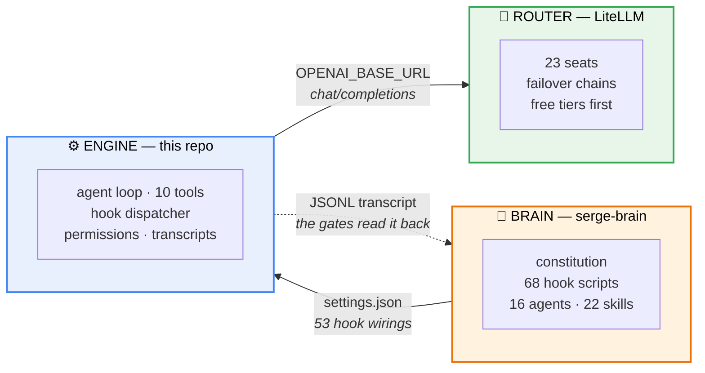

# serge-engine

An MIT agent runtime for [serge-brain](https://github.com/robsevo/serge-brain) —
the half that repo deliberately does not ship.

It speaks OpenAI-compatible HTTP to a local router, implements all 13 lifecycle
hook events, and writes the JSONL transcripts the brain's gates read back. It
never calls Anthropic.

---

## Table of contents

1. [Why this exists](#1-why-this-exists)
2. [How it fits](#2-how-it-fits) — the diagrams
3. [Install and pair](#3-install-and-pair)
4. [What works, and what does not](#4-what-works-and-what-does-not)
5. [The contract](#5-the-contract)
6. [Verification](#6-verification)
7. [Design notes](#7-design-notes)
8. [License](#8-license)

---

## 1. Why this exists

serge-brain is a configuration layer with no program in it. Its installer says so
in as many words:

```
install.sh:70   # The engine is deliberately not in this repo — it is a Claude
                # Code derivative.
install.sh:72   [ -n "$ENGINE" ] || die "--engine is required."
```

Every user had to supply `--engine /path/to/engine`, and the only thing that had
ever satisfied that slot was Anthropic's proprietary CLI — which serge-brain
cannot redistribute. The result was a public repo almost nobody could actually
run.

This is the missing half. It is not a Claude Code fork and shares no code with
one; it is a fresh implementation of the interface the brain expects.

> **Status: young, and honest about it.** The headless path (`-p`) is complete
> and tested. There is no interactive TUI yet — see
> [§4](#4-what-works-and-what-does-not) before you decide which engine to run.

## 2. How it fits

### 2.1 Three parts, two seams

The brain holds the behaviour, this repo holds the loop, and the router holds
the models. Each seam is a contract, which is what lets any part be swapped.



The dotted edge is the one people miss. The transcript is not a log — the brain's
`claims-gate` walks it to check whether a turn's claims are true. Write it wrong
and a whole class of guardrail silently stops working.

### 2.2 One turn


Two edges carry most of the weight:

**`PostToolUse` can block.** The call already happened, so blocking cannot undo
it — what it does is force the model to deal with the finding instead of moving
on. The brain's `algo-gate`, `semgrep-scan` and `arch-gate` all work this way.
An engine that fires the hook and discards its verdict looks fully gated while
every one of those is dead.

**`Stop` can send the turn back**, and carries `stop_hook_active` when it does.
Without that flag a blocking gate has no way to stand down, and the session
loops forever.

## 3. Install and pair

Two clones, side by side. That is the whole integration.

```bash
git clone https://github.com/robsevo/serge-brain
git clone https://github.com/robsevo/serge-engine

( cd serge-engine && npm run build )
( cd serge-brain  && ./install.sh --engine ../serge-engine )
```

`npm run build` copies `src/` to `dist/` — there is no bundler and there are **no
dependencies**, so it is instant and needs no network. The brain's installer then
verifies the engine answers `--version`, resolves hook paths into
`~/.serge/settings.json`, and stops before writing a key or starting a service.

**Try it without touching an existing install:**

```bash
SERGE_HOME=~/.serge-trial ./install.sh --engine ../serge-engine
SERGE_HOME=~/.serge-trial serge -p "reply with: ok"
```

### Why two repos rather than one

| | serge-brain | serge-engine |
|---|---|---|
| what it is | configuration: hooks, gates, skills, router config | a runtime: agent loop, tools, permissions |
| changes when | how the agent should *behave* changes | what the agent *can do* changes |
| swappable | no — it is the product | yes — any conforming engine works |

A monorepo would couple them: every hook tweak would ship a new engine, and the
brain could no longer claim to run on *any* conforming engine — which is exactly
the property that lets you keep a Claude Code derivative underneath while this
one grows an interactive mode.

They meet at a contract, not an API. If you pin, pin both to the same revision of
[`docs/ENGINE-CONTRACT.md`](docs/ENGINE-CONTRACT.md).

## 4. What works, and what does not

**Works:**

- streaming completions against any OpenAI-compatible endpoint, with a request
  timeout and bounded jittered retry on transient failures
- **10 tools** — `Bash` `Read` `Write` `Edit` `MultiEdit` `NotebookEdit` `Glob`
  `Grep` `Task` `ExitPlanMode`
- **all 13 hook events**, three deny protocols (`exit 2`,
  `{"decision":"block"}`, `hookSpecificOutput.permissionDecision`), and blocking
  `PostToolUse`
- a **permission system**: modes, allow/deny rules, workspace boundary,
  dangerous-command heuristics
- subagents (`Task`) on a reduced tool set, with no recursive spawning
- context compaction that keeps the first prompt and the working set
- JSONL transcripts in the shape the brain's gates expect

**Does not, stated plainly so nobody discovers it later:**

- **headless only** (`-p`) — there is no interactive session yet
- no MCP, no skills / commands / agents loading, no session resume
- no `Explore` tool

For an interactive session today, point the brain at a Claude Code–derived
engine instead: `./install.sh --engine /path/to/that`.

## 5. The contract

An engine has to satisfy four things for the brain's installer to accept it —
all four are read straight out of `install.sh`:

| requirement | source |
|---|---|
| a launcher at `serge`, `bin/serge`, `claude` or `bin/claude` — **first match wins** | `install.sh:117` |
| `node dist/cli.mjs --version` answers | `install.sh:105` |
| a `package.json` | `install.sh:92` |
| the path is a real directory | `install.sh:115` |

The launcher search order matters more than it looks. It must find a **shell**
launcher, because that is what exports `CLAUDE_CONFIG_DIR`,
`CLAUDE_CODE_USE_OPENAI` and `OPENAI_BASE_URL` and brings the router up. A bare
Node wrapper in `bin/` sets none of that, and the engine silently falls back to
whatever provider it was built against.

Beyond the layout, the runtime contract is the 13 events, their payload fields,
the transcript shape, and the deny protocols. All of it is in
[`docs/ENGINE-CONTRACT.md`](docs/ENGINE-CONTRACT.md) — **generated by driving a
running engine and recording what actually arrives on a hook's stdin**, not
written by hand.

## 6. Verification

```bash
node tests/tools.test.mjs              # 20 assertions across the 10 tools
node tests/permissions.test.mjs        # 28-case permission matrix
node tests/conformance/run.mjs --engine .   # 18 contract checks
```

Every suite carries a `--self-test` that replaces the thing under test with a
stub and asserts the suite **fails**:

```bash
node tests/tools.test.mjs --self-test
node tests/permissions.test.mjs --self-test    # an allow-everything gate must fail 19 deny cases
node tests/conformance/run.mjs --self-test     # an inert engine must be rejected
```

That inversion is the point. This project exists because a previous attempt at
an engine shipped 343 lines of hardcoded simulation, "verified" by a probe that
passed on any response over 50 characters — a test that could not fail, checking
an engine that never ran. A suite that still passes when the checker is removed
is not testing the checker.

The conformance harness follows the same rule: it never asks the engine what it
supports. It builds a throwaway `SERGE_HOME`, wires a probe into all 13 hook
slots, drives the real binary, and reports only what arrived on stdin. Tool
execution is confirmed by a **sentinel file** the tool was told to create, not by
the tool's own report.

## 7. Design notes

**No dependencies.** `package.json` has an empty `dependencies` block and the
build is a file copy. An agent runtime that can read your filesystem and run
shell commands is the last place to inherit a transitive supply chain.

**The router does the routing.** The engine sends `model: <seat>` and reads the
stream. It has no fallback table, no retry-across-seats logic, no opinion about
which model should answer — that is `litellm.yaml`'s job in the brain repo.
Duplicating it here would produce two tables that disagree.

**Headless denies what it cannot ask.** With no TTY, a permission prompt has no
answer, so it resolves to **deny** with a message naming the rule that would
allow it. Auto-approving instead would make `default` mode a lie, and every
`ask` in the permission table exists because something could not be judged safe.

**The transcript is written as the turn happens**, not summarised at the end.
The gates read it to decide whether a turn's claims are true, so it has to record
what happened rather than what the model said happened.

## 8. License

MIT — see [LICENSE](LICENSE).

The brain it serves,
[serge-brain](https://github.com/robsevo/serge-brain), is also MIT. Neither
contains nor requires Anthropic's proprietary engine.
